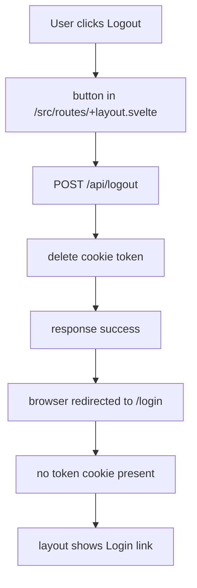

# Authentication Flow Presentation

## Overview

This document describes the login and logout flow for the `sveltekit-jwt-example` app.

Key pieces:

- `src/routes/login/+page.svelte` — login page UI
- `src/routes/api/login/+server.js` — login API endpoint
- `src/hooks.server.js` — global request hook that validates JWT and sets `locals.user`
- `src/routes/+layout.server.ts` — provides auth state to the root layout
- `src/routes/+layout.svelte` — shows login/logout controls
- `src/routes/api/logout/+server.js` — logout API endpoint

---

## Login Flow

```mermaid
flowchart TD
  A[Browser opens /login] --> B[/src/routes/login/+page.svelte/]
  B --> C[submit email/password]
  C --> D[POST /api/login]
  D --> E[db query: SELECT * FROM users WHERE email=?]
  E --> F[verify bcrypt password]
  F -->|valid| G[createToken(user)]
  G --> H[cookies.set("token")]
  H --> I[browser redirects to /dashboard]
  I --> J[/src/hooks.server.js/]
  J --> K[verifyToken(token)]
  K --> L[set event.locals.user]
  J --> M[/src/routes/+layout.server.ts/]
  M --> N[return { user: locals.user }]
  N --> O[/src/routes/+layout.svelte/ shows logged-in UI]
  I --> P[/src/routes/dashboard/+page.svelte/]
  P --> Q[dashboard content rendered]
```

### Notes

- The login endpoint stores a JWT in an HTTP-only cookie named `token`.
- After setting the cookie, the browser reloads to `/dashboard` so the server can read the cookie.
- `hooks.server.js` runs before every request and verifies the cookie.
- Auth state is provided to the layout via `+layout.server.ts`.

---

## Logout Flow



### Notes

- Logout is implemented as a POST request to `/api/logout`.
- The server deletes the `token` cookie and returns success.
- The browser then navigates to `/login`.
- Without a valid `token`, `hooks.server.js` does not set `locals.user`.

---

## Important Behavior

- Protected routes like `/dashboard` are enforced in `src/hooks.server.js`.
- When no valid `event.locals.user` exists, the hook redirects to `/login`.
- The root layout uses `page.data.user` to show either the logged-in state or a login link.

---

## File Mapping

- `src/routes/login/+page.svelte` — login form and redirect logic
- `src/routes/api/login/+server.js` — authenticate credentials and set cookie
- `src/hooks.server.js` — verify cookie and set `locals.user`
- `src/routes/+layout.server.ts` — make auth state available to all pages
- `src/routes/+layout.svelte` — render login/logout UI
- `src/routes/api/logout/+server.js` — clear the auth cookie
